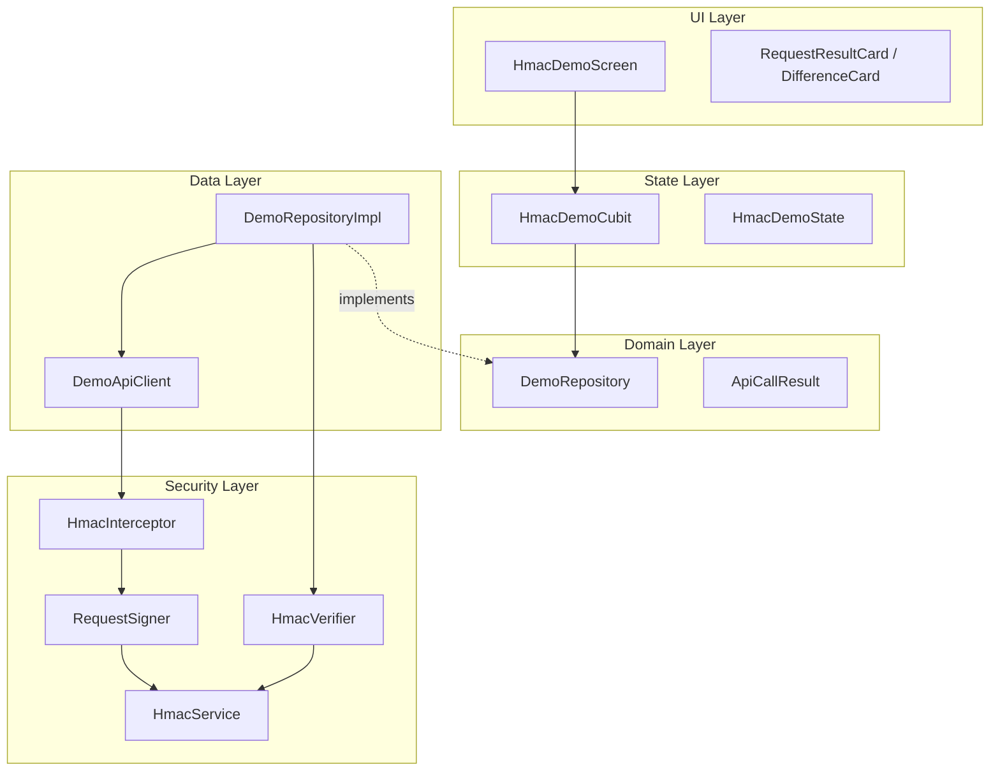
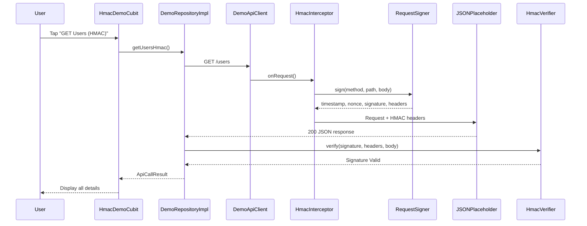

# Demo Flutter App — HMAC API Security POC

A Flutter demo application showcasing modern mobile app development practices **and** a complete, educational Proof of Concept for **HMAC-SHA256 request signing** in mobile API security.

## Table of Contents

- [Project Overview](#project-overview)
- [What is HMAC?](#what-is-hmac)
- [HMAC POC Features](#hmac-poc-features)
- [Architecture](#architecture)
- [Request Flow](#request-flow)
- [File Structure](#file-structure)
- [How the Signature is Generated](#how-the-signature-is-generated)
- [Canonical String Example](#canonical-string-example)
- [Sample Headers](#sample-headers)
- [Sample Request & Response](#sample-request--response)
- [How the Backend Verifies](#how-the-backend-verifies)
- [Security Limitations](#security-limitations)
- [Production Recommendations](#production-recommendations)
- [Original App Setup](#original-app-setup)

---

## Project Overview

This project contains two layers:

1. **TMDB Movie App** — Browse trending movies, favourites, authentication (existing).
2. **HMAC Security POC** — Interactive demo accessible from **Account → HMAC API Security** that teaches request signing with HMAC-SHA256.

The POC uses [JSONPlaceholder](https://jsonplaceholder.typicode.com) as the backing API and simulates backend verification locally (since public APIs don't validate HMAC).

---

## What is HMAC?

**HMAC** (Hash-based Message Authentication Code) is a cryptographic technique that combines a **secret key** with a **message** (the request data) using a hash function (SHA-256) to produce a **signature**.

| Property | What it means |
|----------|---------------|
| **Authentication** | Proves the request came from someone who knows the secret |
| **Integrity** | Detects if the request body or headers were modified in transit |
| **Non-repudiation** | The signer cannot deny creating the request (within the trust model) |

HMAC is **not encryption** — it does not hide data. It proves the data is authentic and unmodified.

---

## HMAC POC Features

### Without HMAC
- **GET Users** — Plain GET to `/users`
- **POST Data** — Plain POST to `/posts`

### With HMAC
- **GET Users (HMAC)** — Signed GET with `Authorization`, `X-Timestamp`, `X-Nonce`, `X-Signature`
- **POST Data (HMAC)** — Signed POST with the same headers

### Tamper Demonstrations
- **Tamper Body** — Shows signature invalidation when body changes after signing
- **Tamper Timestamp** — Shows failure when timestamp is modified
- **Wrong Secret Key** — Shows failure when server uses a different secret

Each request displays: URL, headers, response, time taken, status, and (for HMAC) timestamp, nonce, signing string, signature, and verification result.

---

## Architecture



---

## Request Flow



---

## File Structure

```
lib/
├── security/                              # Reusable HMAC security layer
│   ├── hmac_config.dart                   # Secret, header names, algorithm
│   ├── hmac_service.dart                  # Low-level HMAC-SHA256 (crypto pkg)
│   ├── nonce_generator.dart               # Cryptographically secure nonce
│   ├── signature_generator.dart             # Canonical string + signing
│   ├── request_signer.dart                # Orchestrates full signing flow
│   ├── hmac_verifier.dart                 # Simulated backend verification
│   └── interceptors/
│       └── hmac_interceptor.dart          # Dio interceptor (auto-sign)
│
├── screens/hmac_demo/
│   ├── cubit/
│   │   ├── hmac_demo_cubit.dart           # State management
│   │   └── hmac_demo_state.dart           # Freezed state
│   ├── data/
│   │   ├── demo_api_client.dart           # JSONPlaceholder Dio client
│   │   └── demo_repository_impl.dart      # 4 API calls + verification
│   ├── domain/
│   │   ├── api_call_result.dart           # Result model
│   │   └── demo_repository.dart           # Repository contract
│   └── ui/
│       ├── hmac_demo_screen.dart          # Main POC screen
│       └── widgets/
│           ├── request_result_card.dart     # Request/response display
│           └── difference_card.dart       # Educational comparison card
│
test/security/
├── hmac_service_test.dart
└── hmac_verifier_test.dart
```

---

## How the Signature is Generated

1. **Generate timestamp** — Current Unix epoch seconds (`1700000000`)
2. **Generate nonce** — 32-character cryptographically random string
3. **Hash the body** — `SHA-256(request body)` as lowercase hex (empty string hash for GET)
4. **Build canonical string** — Concatenate method, path, timestamp, nonce, body hash with `\n`
5. **Compute HMAC** — `HMAC-SHA256(canonical_string, secret_key)` as lowercase hex
6. **Attach headers** — `Authorization`, `X-Timestamp`, `X-Nonce`, `X-Signature`

---

## Canonical String Example

For a GET request to `/users`:

```
GET
/users
1700000000
aB3xK9mP2nQ7rT5wY8zC1dF4gH6jL0eN
e3b0c44298fc1c149afbf4c8996fb92427ae41e4649b934ca495991b7852b855
```

For a POST to `/posts` with body `{"title":"HMAC Demo Post","body":"...","userId":1}`:

```
POST
/posts
1700000001
xY7zW2vU4tS6rQ8pO0nM3lK5jI9hG1fD
a1b2c3d4e5f6...  (SHA-256 of the JSON body)
```

---

## Sample Headers

```
Authorization: HMAC-SHA256 Credential=demo-client
Content-Type: application/json
Accept: application/json
X-Timestamp: 1700000000
X-Nonce: aB3xK9mP2nQ7rT5wY8zC1dF4gH6jL0eN
X-Signature: 7f3a9b2c1d4e5f6a8b9c0d1e2f3a4b5c6d7e8f9a0b1c2d3e4f5a6b7c8d9e0
```

---

## Sample Request & Response

**Request:**
```
GET https://jsonplaceholder.typicode.com/users
Authorization: HMAC-SHA256 Credential=demo-client
X-Timestamp: 1700000000
X-Nonce: aB3xK9mP2nQ7rT5wY8zC1dF4gH6jL0eN
X-Signature: 7f3a9b2c...
```

**Response (200):**
```json
[
  {
    "id": 1,
    "name": "Leanne Graham",
    "username": "Bret",
    "email": "Sincere@april.biz"
  }
]
```

---

## How the Backend Verifies

The simulated `HmacVerifier` (representing server-side logic):

1. **Extract** `X-Timestamp`, `X-Nonce`, `X-Signature` from request headers
2. **Validate timestamp** — Reject if older than 5 minutes (replay protection)
3. **Rebuild canonical string** — Same format as the client used
4. **Recompute HMAC** — Using the shared secret
5. **Constant-time compare** — `recomputed == received` (prevents timing attacks)
6. **Return verdict** — `✔ Signature Valid` or `✘ Signature Invalid`

---

## Security Limitations

| Limitation | Explanation |
|------------|-------------|
| **Secret in app binary** | Anyone can decompile the APK/IPA and extract the hardcoded secret |
| **HMAC ≠ encryption** | Request/response bodies are visible over the wire without HTTPS |
| **No device trust** | HMAC cannot prove the request came from a genuine, unmodified app |
| **Shared secret model** | All clients share one key; compromising one client compromises all |
| **JSONPlaceholder ignores headers** | Real backend validation is simulated locally in this POC |

### Why HTTPS is still required

HMAC protects **integrity and authenticity** of the message content. HTTPS (TLS) protects **confidentiality** (encryption in transit) and **server identity** (certificate validation). They solve different problems and must be used together.

### Why HMAC alone cannot secure a mobile app

Mobile apps run on attacker-controlled devices. The secret, signing logic, and even certificate pinning can be reverse-engineered using tools like Frida, jadx, or Hopper. HMAC is one **layer** in defense-in-depth, not a silver bullet.

---

## Production Recommendations

1. **Never hardcode secrets** — Use server-issued, per-user or per-device API keys
2. **Short-lived credentials** — Rotate keys; use OAuth 2.0 / JWT for session auth
3. **Certificate pinning** — Prevent MITM even with HTTPS
4. **Device attestation** — Google Play Integrity / Apple App Attest
5. **Rate limiting** — Server-side throttling per key/IP
6. **Nonce store** — Server tracks used nonces to prevent replay within the time window
7. **Key rotation** — Support multiple active keys during rotation periods
8. **Obfuscation** — ProGuard/R8 (Android), symbol stripping (iOS) — raises the bar, not a fix

---

## Original App Setup

### Prerequisites

- Flutter SDK (>=3.9.0)
- Dart SDK (>=3.9.0)

### 1. Clone and install

```bash
git clone https://github.com/yourusername/Demo-Flutter.git
cd Demo-Flutter
flutter pub get
```

### 2. Configure TMDB API Key (for movie features)

```bash
cp lib/core/network/api_constants.sample.dart lib/core/network/api_constants.dart
```

Replace placeholders in `api_constants.dart` with your TMDB credentials from [themoviedb.org](https://www.themoviedb.org/settings/api).

### 3. Generate code

```bash
dart run build_runner build --delete-conflicting-outputs
```

### 4. Run

```bash
flutter run
```

Navigate to **Account → HMAC API Security** to access the POC.

### 5. Run security tests

```bash
flutter test test/security/
```

---

## Tech Stack

| Category | Technology |
|----------|------------|
| State Management | `flutter_bloc` (Cubit) |
| Data Classes | `freezed`, `json_serializable` |
| Navigation | `go_router` |
| HTTP Client | `dio` |
| HMAC Signing | `crypto` (HMAC-SHA256) |
| Error Handling | `dartz` (Either type) |
| Local Storage | `shared_preferences` |

---

## License

This project is for demonstration and educational purposes.

## Author

Rahul Kumawat
